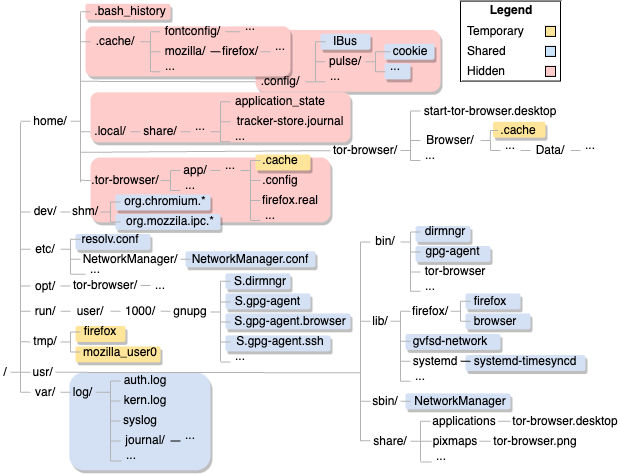

# Calypso disk data hiding
Fully-functional prototype of Calypso as a kernel module for the Linux kernel v5.4. Calypso hides data on the free blocks of the disk to conceal sensitive data in a plausible deniable way.

**Note:** Even if you're not interested in this particular system, this is a very good project for anyone looking to understanding how file systems and block device drivers work under the hood, as well as implementing kernel modules.

## Project structure
* calypso/ - Code.
* dissertation/ - Final dissertation and related files.
* figures/ - Graphs and plots used throughout the guide.
* kernel_modules/ - Examples of simple kernel modules to practice.
* logging/ - Some of the data used to produce the functionality results. 
* presentation/ - Presentation slides.

## MSc Dissertation: Traceless Execution Support for Privacy Enhancing Technologies
* **Extended abstract:** [86403-daniela-lopes-resumo.pdf](dissertation/86403-daniela-lopes-resumo.pdf) or [86403-daniela-lopes-resumo.pdf](https://fenix.tecnico.ulisboa.pt/downloadFile/563345090419882/86403-daniela-lopes-resumo.pdf)

* **Full version:** [86403-daniela-lopes-dissertacao.pdf] (dissertation/86403-daniela-lopes-dissertacao.pdf) or [86403-daniela-lopes-dissertacao.pdf] (https://fenix.tecnico.ulisboa.pt/downloadFile/563345090419881/86403-daniela-lopes-dissertacao.pdf)

This project was originally implemented in 2021.

## I. Introduction

### Overview
In the digital age, internet users increasingly face challenges to their privacy and freedom of speech, exacerbated by censorship and oppressive regimes. To combat these issues, Privacy Enhancing Technologies (PETs) have been developed. These tools are designed to bypass censorship and maintain user anonymity but often fall short due to their complexity, resource demands, and the significant digital footprint they leave.

### The Problem
Many existing PETs are not user-friendly, particularly for those with limited technical skills or computational resources. They require complex setup and maintenance, including managing cryptographic keys and configurations. This complexity can deter users, especially those under threat from repressive regimes, where using such tools might be risky or illegal. Moreover, these technologies often alter the device's digital footprint, making users susceptible to forensic analysis—a significant risk in environments with strict controls and vague legal boundaries.

### Our Solution: Calypso
Calypso introduces a novel approach to address these challenges. It offers a system for traceless PET execution, creating a "shadow drive" that utilizes free disk space to conceal a steganographic file system. This allows users to store sensitive data and run programs without leaving a trace, supporting private sessions with persistent state while maintaining system performance.

### Key Features:
* **Deniable Storage and Execution:** Enables the concealment of sensitive data and programs, ensuring privacy and security even in hostile environments.
* **Minimal Footprint:** Designed to leave no discernible changes on the device, reducing the risk of detection through forensic analysis.
* **Resource Efficiency:** Operates efficiently without demanding excessive computational resources or complex configuration, making it accessible to a wider range of users.
* **Security:** Utilizes cryptographic methods to ensure that only authorized users can access the hidden data, providing a layer of security against unauthorized access.

## II. Background

### Case Study: Forensic Analysis of the Tor Browser
We selected the *Tor browser* to perform an empirical study that installing and executing this software has on the persistent state of a Linux system. 

**Methodology:** Assuming Tor browser binaries already exist on our testbed virtual machine (VM), we created five different snapshots of the VM to capture its state: 
1. Before installing Tor browser; 
2. After having Tor browser installed;
3. During the execution of the Tor browser; 
4. After executing the Tor browser;
5. After uninstalling the Tor browser according to the recommendations on the website. 

Afterward, we performed differential analysis of the five stages to identify relevant differences  between snapshots caused by installing and executing the Tor browser.

We audited and logged file accesses using *Volatility* [16], *diffing* the system's directories, and the *Linux Audit Framework* [17].

**Observations:** There is a multitude of persistent traces left by installing and executing a PET such as the Tor browser. The main outcomes are:
* The existence of several temporary files spread across multiple directories, which means these will stay in non-allocated space until that space is overwritten, unless the user executes secure software removal, which may also leave observable traces; 
* It accesses several files and libraries that are shared with other applications, making it very difficult to isolate the accesses; and 
* Hidden files are not going to be erased when the application is erased from the system, and a regular user might not notice them. Thus, even if Tor is erased every time after being used or booted from a live system, it is very hard to prevent a forensic analyst from being able to observe that Tor was indeed in that system, through techniques such as:
    * File carving to recover files from unallocated space;
    * Analysis of patterns in the access of files by examining timestamps of files that are already known to be frequently accessed by the application; or
    * Through direct observation of the files in the system, such as journaling and history files like bash history.

*Caption: Tor browser forensic traces.*

### The Linux Kernel Block I/O Stack

The block I/O stack is the set of the independent kernel components that support the processing of data transfer requests to block devices, such as read and write operations.

*Caption: Linux kernel block I/O stack.*

**Storage units:** The smallest unit of data transfer from disk is the *sector*. It generally consists of a group of 512 adjacent bytes. A *block* is the smallest addressable unit of a file system. It consists of a group of
adjacent sectors, generally of 4096 bytes, equivalent to 8 sectors. A *page* is a memory unit belonging to the virtual memory mechanisms and serves as a buffer for intermediate file system operations. Normally,
each page has 4096 bytes size and maps to file system blocks.

**Virtual file system (VFS):** The VFS is an abstract layer that exposes a uniform interface for applications to interact with the file system, without depending on the implementation of each file system. This
mechanism allows Linux to support multiple file systems. Each file system implements the operations to be performed on files, which are going to be called by the VFS. This component is also responsible for checking if the requested data is already mapped into memory in the page cache, or if needs to be read from the disk. In case it needs to be read from the disk, the VFS activates the mapping layer.

**Mapping layer:** This layer is in charge of computing the location of the data, based on file systemspecific information, determining the block numbers in the disk containing the target file.

**Page cache:** It caches file data from a disk to make subsequent I/O faster. The page cache is addressed when reading and writing file data. In the case of a read, if it contains the desired block contents, that
data is copied to the user, otherwise, a page fault is triggered and the contents are fetched from the disk. During writes, the contents are initially written to the page cache, later written to disk.

**Block layer:** This layer is responsible for managing input/output operations performed on block devices. It receives the request to retrieve the desired data, not necessarily adjacent on disk. Because of this,
this layer might start several I/O operations, each represented by a bio structure.

**I/O Scheduler:** An I/O scheduler manages a block device’s request queue to reduce seek times by merging and sorting requests. For instance, it can collect multiple bios to obtain a smaller number of
requests, but these must be physically adjacent to the ones already in the request.

**Block device drivers:** These contain the code that handles the I/O requests to each block device. They receive file system requests and issue the corresponding I/O operations to the block device.

**Block devices:** These devices are characterized by random access to data, making them ideal to be used as storage devices, such as our native partition. They are complex to ensure performance.

### I/O Requests and I/O Request Structures

An I/O request works as follows. A process accesses the disk via a read or write system call, which invokes the respective VFS operations. The VFS checks the page cache and if the data is not present, it calls the mapping layer to compute the location of the data in the disk. Then, the block layer creates a list of bio structures, each representing a block I/O operation to be submitted to the disk. Subsequently, the block layer translates bios to requests. Finally, the block layer dispatches the requests to the device driver, where the actual data transfer happens. The request queue allows the block layer to pass requests to the device driver. It contains a linked list of requests and pointers to functions that handle
requests just before the submission to the respective device. Each device is generally associated with a private request queue that can only be accessed by the respective driver. It contains the available
requests for that block device, managed by the I/O scheduler, responsible for reordering requests, i.e, making the operations semi-sequential to speed up mechanical disks such as HDDs.

*Caption: I/O request structures..*

**request_queue:** Request queues maintain the pending requests to a block device. The block device driver grabs requests from the request queue and submits them to the associated block device.

**request:** The request structure describes each request to a block device and it is the unit that composes a request queue. The request structure's fields indicate the exact position of the data to be transferred,
such as the start sector, the number of sectors to transfer for the current request, and the number of requests still pending. Each request can be composed of multiple bios to optimize request processing.

**bio:** The bio structure represents the block I/O request that pertains to a set of consecutive sectors in the disk. It is associated with a vector with each position, a bio vec structure mapping to a contiguous chunk of a memory page. The vector of bio vec structures allows performing block I/O operations from multiple locations in memory. These pages are used to receive data from and send data to a block device. It contains other fields such as the target block device, the number of the sector in the target block device, flags that identify the operation to be performed, and the total size of the request in bytes.

## III. Related Work

Digital privacy faces threats from various sources, leading to the development of anti-forensic solutions. These technologies aim to reduce digital traces left by software execution, enhancing user privacy. Existing solutions include approaches like process isolation, deniable file systems, and .

### Process Isolation

* **Lacuna** [1] creates secure channels and private VM sessions to protect data during IPC, suitable for applications like web browsers.
* **CleanOS** [2] focuses on mobile privacy, managing sensitive data with cloud services to prevent loss or theft.
* **PrivExe** [3] offers encrypted execution environments, securing filesystem writes and memory pages, while restricting IPC to enhance privacy.
* **Residue-Free Computing** [4] isolates program interactions to memory, using containers and RAM disks to prevent persistent changes. However, it lacks support for persistence and plausible deniability.

*Caption: Residue-free computing architecture.*

### Deniable File Systems for Single-Snapshot Attacks
**Single-Snapshot Attacks** An adversary has access to the device at a single point in time for forensic analysis.

* **StegFS** [5] is a system designed to enhance digital privacy by embedding a hidden file system within the unallocated space of a device's existing file system, leveraging steganography. While it contributes to data deniability, especially in multi-user environments, StegFS does not maintain the disk's entropy through random data patterns in the hidden blocks, which could potentially weaken its effectiveness against forensic analysis.

### Multi-Snapshot Attacks

**Multi-Snapshot Attacks** An adversary has access to the device at multiple points in time for forensic analysis. This way, the attacker is able to observe modifications that indicate the existence of hidden data.

* **Oblivious RAM (ORAM) and Variants (HIVE, Datalair):** [6] [7] [8] These techniques focus on concealing data access patterns to prevent detection by adversaries. While effective in hiding data accesses, they do not conceal the system's presence and often result in significant performance penalties, such as slower operations and suspicious disk write patterns.

* **PM-DM:** [9] This block device mapper addresses the performance issues associated with ORAM by opting for plausible modifications between snapshots instead of random access patterns. It seeks to preserve data locality and overall performance by making changes that can plausibly be attributed to legitimate use. Despite improvements, write operation performance may still indicate the existence of a hidden system.

* **Ever-changing Disk:** [10] A firmware solution designed for SSDs that segregates data into hidden and public volumes, writing hidden data alongside pseudorandom patterns. Although innovative, its partitioning scheme and firmware design are seen as potential vulnerabilities.

**Artifice:** [11] Targets multi-snapshot attack prevention by disguising data writes with redundant operations and combinatorial cryptography. It enhances data resilience using erasure codes and checksums. Despite its strengths in data protection and resilience, Artifice faces challenges with disk entropy change, external hardware dependency, and lacks protection during system swaps or hibernation. A follow-up to Artifice suggests using *Shamir Secret Sharing* [14] to improve the distribution of hidden data, aiming to blend it seamlessly with regular disk blocks, though this approach alters disk entropy, impacting deniability.

*Caption: Artifice's generation of carrier blocks to hide user data. The block device is contained on removable media. Free space in the host file system is filled with pseudo-random blocks.*

## IV. Threat Model

Calypso is designed to safeguard privacy and enhance security by enabling users to execute Privacy Enhancing Technologies (PETs) without leaving detectable traces on their system. It specifically aims to protect against adversaries who, with physical access and advanced forensic tools, attempt to uncover the presence of Calypso or any activities carried out with its assistance. The primary threat scenario involves situations where the device may be examined under scrutiny, such as by authorities at border crossings or in environments where censorship is enforced by oppressive regimes.

The core objective of Calypso is to ensure **plausible deniability**, meaning it should be impossible for forensic analysts to prove that Calypso was installed or used on a device. This goal is particularly critical for users in sensitive roles, like journalists reporting on humanitarian issues under repressive governments. Plausible deniability is achieved through two main strategies:

* **Isolation:** Calypso ensures that all data related to its operation is kept separate from the device's native file system. This isolation prevents any information processed or generated by Calypso from leaking into areas where it could be discovered during forensic analysis.

* **Non-Observability:** The system is designed so that an adversary cannot detect any hidden data within the free blocks of the native file system. By ensuring that no observable changes are made to the disk's persistent state, Calypso makes it impossible to identify its presence or activities based on disk examination.

In essence, Calypso provides a secure environment for executing PETs, focusing on protecting user privacy through mechanisms that prevent the detection of its usage or the existence of hidden data. This protection is vital for users who require confidentiality and security in their digital activities, particularly when facing potential examination by hostile parties.

## V. Design

Calypso is a sophisticated system designed to enhance digital privacy and security through the creation of a secondary, hidden file system, termed the "shadow partition." This partition utilizes the free blocks of the native file system for data storage, employing steganography and encryption to ensure that no visible changes are detectable on the machine's persistent state. Here's a simplified overview of Calypso's operation and features:

### Core concept

* **Shadow Partition:** A secondary file system created within the unallocated space of the device's native file system. It encodes persistent data using data-hiding techniques, ensuring that the modifications are imperceptible. This is represented in the following Figure:

*Caption: Calypso architecture.*

### Main components

* **Calypso Block Device Driver:** A kernel module that forms the heart of Calypso, facilitating the creation and management of the shadow partition.
* **Block Mapper and Encoder:** These components work together to handle data requests to the shadow partition, encoding and hiding Calypso's data within the free blocks of the native file system.
* **Native Requests Hook and Read Hook:** These components monitor and manage the interactions with the native file system, ensuring that Calypso's operations do not interfere with or compromise the native data.

These components are described in the following Figure:

*Caption: Calypso driver internals.*

### Key Features

* **Traceless Bootstrap:** Initial setup of Calypso is designed to be undetectable, using rootkit techniques or steganography to conceal the bootstrap process.
* **Block Allocation and Mapping:** Calypso tracks which native blocks are used for the shadow partition, ensuring data integrity and avoiding conflicts with the native file system. This is described in the following Figure:

*Caption: Block mappings.*

* **Monitoring Native Changes:** It actively monitors changes to the blocks within the native file system to prevent overwrites that could damage the shadow partition.
* **Persisting Metadata:** Critical for system recovery, Calypso stores its metadata within native free blocks, allowing it to resume operation seamlessly after being unloaded.
* **Deniably Encoding Data Blocks using Entropy:** Data is stored in a way that maintains the original entropy of the blocks, making it difficult to detect alterations.
    * The **entropy** of a block is the variability of the bytes in it. For instance, a block with an equivalent count of every possible byte has the highest entropy possible, while a block only with zeroes is going to have the lowest possible entropy. This measurement is calculated using the *Shannon entropy* [12] [13] for each block.
    * The **entropy differential** is the measure we established to quantify how much a block has been changed, thus how observable it is that there is a hidden mechanism in the system such as Calypso. It consists of the absolute value of the difference between two entropy values, taken in two distinct moments in time. These values are normalized to be between 0 and 1.
    * The **optimal entropy threshold** is a value that allows the user to customize the selection of which blocks Calypso uses to hide its data. The optimal entropy threshold value depends on:
        * The characteristics of the native free blocks; 
        * The amount of storage capacity;
        * The level of security the user needs and the danger they are facing.
* **Multi-Snapshot Attacks and Plausible Deniable Footprints:** We attempt to make all changes made by Calypso nonobservable by limiting the usable blocks to the native free blocks with an entropy value above a customizable threshold. For instance, we can limit the system to use only previously encrypted blocks to replace with Calypso's encrypted data, thus maintaining the characteristics of the free space. So, we cannot state that no changes were made to those blocks, but we can claim these changes were originated from the system s regular utilization, such as temporary keys that regularly get generated and erased. From this idea, we can expand to higher disk workloads, to sustain more deniable storage capacity. We named this concept **plausible deniable footprints**.
    * A particularly interesting idea for future work would be to hide data on space that is used by streaming services such as *Netflix* when streaming a movie.

## VI. Implementation

Calypso's prototype was built as a kernel module, targeted
for Linux platforms running the kernel version 5.4.

### Retrieving Usable Blocks for Storage
Assembling a set of blocks that we could use to store the data is vital to ensure Calypso's functionality and persistence. Since we do not want to disrupt the native system by overwriting needed blocks and we do not dispose of a partition just for Calypso, we decided to use the free blocks that are not currently in use by the native file system. This can be technically challenging since the Linux Virtual File System (VFS) does not have functions to retrieve the free blocks, so we need to use code specific to the Ext4 file system. We start by obtaining the VFS super block instance of the *struct super_block*. Then, we get the number of Ext4 groups from the super block using the function *ext4_get_groups_count()*, and for each group, we get the respective instance of a *group descriptor*, *struct ext4_group_desc*, using the function *ext4_get_group_desc()*. Each group descriptor contains the location of the block bitmap within that group in the field *bg_block_bitmap_hi*. We read each group block bitmap from disk by calling the function *ext4_read_block_bitmap()*. Subsequently, we
get the number of the first block of this group using the *ext4_group_first_block_no()* function to know the offset that we have to apply to the blocks represented in the group bitmap. Then, we iterate the group bitmap read from disk and set each bit with value 1 in Calypso's bitmap, taking into account the determined group block offset.

### Redirecting and Intercepting Block Requests

*Caption: Calypso requests flow. Calypso request redirection and interception to handle overwrites. The green arrow shows how a request to the shadow partition is handled by redirecting it to the native request queue. Once a request is received by Calypso, the virtual block associated with that request is mapped to the corresponding native block by the block mapper, using the Calypso mapping structures. Then, the request data is encoded and the request is placed in the native request queue. Finally, the request is fetched by the native request handling function and gets redirected to the native block in the block device. The remaining arrows show how Calypso performs interception and handles overwrites. The cyan arrow shows how a write request to a block mapped by Calypso is handled to avoid overwrite. In 1), the request to the native file system is intercepted. This request is put on hold, and in 2), Calypso issues a read to the block to be overwritten. That read copies the contents of the block to a page in memory as shown in 3). In 4), Calypso intercepts the termination function of the read request, activating a second write request, represented in blue, to copy the contents in the memory page, pinned by 5). Step 6) represents the second write request being placed in the native requests queue, where it is going to be fetched by the native block device to be processed. Since we already issued the copy request and its data is on a different memory page, we can resume the initial write request identified by 7).*

Calypso needs to issue the requests received to the native block device. For this, it redirects the requests, as detailed in Figure by the green arrow. Calypso should act as the front end, receiving the requests and adapting them to be processed by the underlying device. The processing of Calypso's requests is initialized with *blk_queue_make_request()* so that requests are passed directly to Calypso's driver instead of going to a request queue. To redirect Calypso's requests to the native device, we need to open it without exclusive mode, obtaining an instance of *struct block_device*. Then, for every request, we need to change the the target device sector and the target device fields, and finally send the request to the native device's request queue using the *generic_make_request()* function. To monitor and prevent changes to blocks mapped by Calypso, our module needs to add functionality to the native request handling function by hooking it. We do this by overriding the pointer to this function,
*make_request_fn*, a field belonging to the instance
of *struct request_queue*. This instance is obtained from the native block device instance previously acquired. When doing this, we need to be careful since any disruption that prevents native requests from being correctly processed may invalidate the entire system. So, we need to store the pointer to the original make_request_fn function so that we can call and restore it when Calypso is unloaded. The substitute function should ensure that the original function gets called at some point. Calypso is using the free blocks of the native file system, which can be overwritten at any time if the native file system requires allocating more space. Calypso intercepts all requests to the native block device, so it detects when its data is about to be overwritten. This is the case when a write request issued by the native file system targets a block mapped by Calypso. So we need to freeze that request while Calypso's data is being copied as shown in the Figure by the blue, pink and cyan arrows.

### Cryptography and Data Hiding
To make Calypso secure and to prevent a forensics inspector from being able to correctly retrieve Calypso's data or meta-data, it needs to rely on several cryptographic primitives. These support concealing all data written to the native partition and retrieving meta-data blocks correctly when Calypso is loaded, without having the mappings to the meta-data blocks in memory. To enable these cryptographic primitives, the user needs to insert a password of its choosing each time the Calypso's kernel module is inserted. This password is going to be used as: i) the initial value to
generate a key deterministically; and ii) a seed to feed to
a pseudo-random number generator.

* **Hiding data blocks:** Calypso needs to hide its data, present in the native partition, from potential adversaries using encryption. This is done whenever a request is remapped to the native device: i) in case of a write request, it replaces the data to be written with its encrypted version; and ii) in case of a read request, it replaces the read encrypted data with its decrypted contents. This way, the native device will only have access to the encrypted data. This requires generating always the same key at run time using the HMAC-based extract-and-expand key derivation function, contributing for Calypso changes to remain non-observable.

* **Storing and retrieving meta-data:** Calypso stores metadata on its own mapped blocks. When Calypso gets unloaded, those memory structures disappear. We need to provide a way for Calypso to determine the first block of meta-data every time it is reloaded, without the support of in-memory structures. This way, it can reconstruct them, allowing the mapping of blocks. Passing a seed to a pseudorandom number generator allows obtaining always the same sequence of pseudo-random numbers. We exploit this concept to generate the numbers for the first block from which we will attempt to store and retrieve meta-data.

*Caption: Calypso meta-data blocks structure.*

## VII. Evaluation

To evaluate our system, we focus on the following goals:
* **Functionality:** Test whether Calypso can sustain the execution of PET applications without file system errors; 
* **Isolation:** Show if Calypso reduces the traces left by PETs in the native file
system; 
* **Security:** Assess the capacity of Calypso to make only deniable changes to the native file system; 
* **Performance:** Test the performance degradation caused by using Calypso, as well as the performance of file system accesses to the shadow partition.

### Functionality

* We monitored the execution of PET applications representative of multiple disk workloads: i) *Tor browser 10.5.8*; ii) *Signal desktop*; and iii) *Megasync desktop*. Then, we assessed whether Calypso can provide the storage resources to accommodate their installation and execution. 
* We used a native partition of 3.5 gigabytes total size, from which 1.8 gigabytes are used and the remaining 1.6 gigabytes are free. This is equivalent to 937,500 total blocks, from which 479,605 are allocated blocks and the remaining 457895 are free. We consider a block as being equivalent to 4096 bytes (default block size in the Ext4 file system). 
Then, Calypso is initialized with 300,000 blocks, approximately equivalent to 1.1 gigabytes.

Calypso can execute multiple PETs with different disk overloads: In all cases, we observe an initial spike during Calypso setup and tool installation, which can be explained by three reasons: i) Calypso's shadow partition was formatted with the ext4 file system; ii) the installation of each tool and associated files on the shadow partition; and iii) each tool, when first executed, stores initial meta-data for usability purposes, such as user accounts or preferences. 

This is followed by a stabilization in smaller increases in the number of used blocks during a regular utilization of the tool, ending in a final increase when Calypso is closed since it persists the meta-data.

*Caption: Block utilization with time for Tor browser executed with Calypso.*

In this Figure, there is a sharp rise in the number of used blocks during the initial stages of setup and Tor execution, up until searching on search engine. This can be justified by the size and big amount of files occupied by the Tor browser folder. When first executed, the browser needs to get server descriptors with information on Tor relays, so Calypso will expand the partition size due to the creation of new files. Then, the evolution in the number of blocks steads in small increases, resulting in two more accentuated ones, namely after opening HiddenWiki, after creating a new email account and after opening a link to a youtube video that requires streaming the video into the machine.

*Caption: Block utilization evoluation with time for Signal desktop executed with Calypso.*

In this Figure, the execution also developed into an expected high rise when the Signal files were moved into the shadow partition. Starting the Signal app caused a smaller increase in the blocks since it needs to update configurations. Linking with the phone app increases the number of blocks since it needs to download all the data associated with Signal from that device, such as contacts, user configurations and previous conversations, heading towards a smaller steady increase in most successive steps. The final pikes occur when opening a received link in the browser and when Signal is closed, probably due to persisting cached memory information onto files.

*Caption: Block utilization evoluation with time for Megasync desktop executed with Calypso.*

*Caption: Comparison of a part of the native partition state, before and after executing Megasync with Calypso, from block 200 to block 90000, as a matrix of 300x300.*

**Calypso allocates blocks using only the native free blocks:** This Figure pictures the initial segment of the native partition state before executing Calypso on the left, and those same blocks after the utilization of **Megasync** with Calypso, on the right. Both segments of the native partition are represented in the form of a matrix of 300x300 dots, where each dot represents a block in a color elusive to its purpose: i) orange blocks are the native allocated blocks that cannot be used by Calypso; ii) purple blocks represent free blocks of the native ext4 file system; iii) pink blocks act as the Calypso file system's meta-data blocks; iv) cyan blocks are used to store the meta-data that allows Calypso to be persistent; and v) yellow blocks are occupied with data generated by Megasync. The first block is indexed by line 0, column 0 of the matrix. The pink, yellow and cyan blocks represent the blocks that were allocated by Calypso to support executing Megasync and they overlap exclusively the native free blocks in purple, ensuring that only the free blocks of the native file system are used.

**Calypso uses the free space of the native partition efficiently:** The following Table shows a summary of the initial state of the native partition used, discriminating the allocated and free blocks ratio and respective space in megabytes (MB). It also shows how the free blocks are affected by the utilization of each PET, and how these blocks are being used, i.e., i) associated with the Calypso file system, ii) for storing
PET-generated data blocks, or iii) Calypso's meta-data blocks.

*Caption: Blocks distribution in native partition being used by Calypso before and after executing each PET's utilization script.*

### Isolation

**Tracing accesses to the native file system:** To trace all the file system interactions, we used the *Linux Auditing System (auditd)*, and recorded three different logs: i) initial state, without executing the Tor browser; ii) executing the Tor browser in the native partition; and iii) executing the Tor browser in Calypso's shadow partition. Then, we generated summary reports on the accessed files, obtaining all the accessed paths during a 10 minute time period with the respective number of accesses to each path. The following Table summarizes our results:

*Caption: Files accessed and respective classification during 10 minutes of auditing the system without Tor installed, while executing Tor in the native file system, and while executing Tor inside Calypso.*

**To help the user navigate the displayed information, we provide an example:** The line containing the results for user data files presents 0 accesses during the initial state, due to no user application being executed during this period. These would be the ideal results for isolation during the execution of a user application such as the Tor browser. The second period reports an increase from 0 to 2,553 accesses, meaning that we can expect the Tor browser executed natively to cause a similar increase. The following period, where we executed the Tor browser from Calypso's shadow partition reveals an increase from 0 to 109 accesses, these targeting 63 different files, meaning that the Tor browser with Calypso is expected to produce about 109 accesses. Besides this, the results in this line allow us to estimate how many accesses Calypso was able to isolate, by subtracting the results from the second period with the results from the third, where we can surmise that Calypso reduced the accesses performed
by the Tor browser to user data related files in about 2444. At last, reporting 109 accesses and 63 different files, during the period where Tor was executed with the Calypso support, means that 109 file system-related system calls were issued to 63 different files, without specifying how many times each of these files were accessed. 

**Calypso notably reduces accesses to files in the native disk partition:** As presented in the Table, most of the file system accesses performed by the Tor browser are diverted from the native file system to the Calypso partition. If we sum all the accesses counts for the Tor browser with Calypso, we can observe a higher number of accesses due to the bootstrap and cleanup processes. However, most of those accesses (11,377) happen in memory only, so they are of no concern. The number of accesses to temporary files that go to disk increased from 99 to 618, but the different file count reduced from 161 to 145. Still, we can improve on these results, but the other accesses to the native file system were heavily reduced compared to executing the Tor browser natively, such as the accesses to binaries, libs and apps, with a reduction from 3,276 to 1,516 accesses and from 1,389 different files to only 370. Overall, the accesses to files in disk reduced significantly when the Tor browser was executed from within Calypso, which shows Calypso produced an encouraging improvement in the domain of isolation.

### Security

**Metric:** *entropy differential*

*Entropy threshold*: Controls the disk changes made by Calypso. This value decides which of the free blocks are going to be used to encode Calypso's encrypted data: only the blocks with entropy equal or above a given entropy threshold will be used to store Calypso data. Intuitively, we expect that increasing the entropy threshold value causes a reduction in the number of
blocks that will change, thus increasing the security levels. We also expect to observe a trade-off between security and storage capacity: if we set higher entropy threshold values, fewer blocks will be considered safe for usage, which will decrease the storage capacity of Calypso shadow partitions.

*Caption: Average block entropy and standard deviation in the blocks of 1GB virtual disks simulating unused space, for multiple file types.*

**Most blocks that constitute highly used media files have an entropy close to the entropy of encrypted blocks:**
In this Figure, we can observe that plaintext files have an average entropy of around 4.5, whereas images, compressed and encrypted files have a high entropy average of almost 8. However, the variability in both images and compressed files is much higher, which means there are a significant number
of blocks that is not well characterized by the average entropy. These are very positive results because these files are very common in most personal computers and may even have a certain turnover, which suggests that many usable blocks may be available on computers with higher usage.

*Caption: Differential entropy statistics.*

**Choosing entropy threshold values:** To analyse appropriate entropy threshold levels, we established 8 different levels, going from the lowest of 0 to the highest, with a value of 7. Then, we measure the initial entropy of all the blocks in the virtual disks and proceed to encrypt all blocks with entropy equal or above each threshold so that we can measure the resulting entropy of all the blocks, simulating Calypso's behaviour. Each line in the Table shows data obtained for each entropy threshold level. The usable blocks count refers to the number of blocks, out of a total of 1,048,576 equivalent to 4 GB, that are usable by Calypso with the respective entropy threshold. The usable blocks count is then shown as a percentage out of the available blocks, shown with the equivalent storage capacity in gigabytes (GB). The average differential shows us the overall difference in entropy after the blocks above a certain threshold have been replaced with encrypted data. The minimum and maximum differential show the best and worst-case scenarios, respectively. 

For a threshold of 0, 100% of the blocks are usable, whereas, for a threshold of 7, that percentage comes down to 74.67%, which is still very reasonable, with about 2.99 usable GB out of a total of 4 GB of free space. Since the files that compose our virtual disks already had a high entropy, even for a threshold of 0 the differential does not surpass 0.11225, very far from the maximum of 1. This means that in a partition with file turnover, we would be able to replace most blocks without inducing significant changes in the partition's overall entropy. For the maximum threshold, the average differential comes down to almost 0, meaning the disk would maintain approximately the same entropy in all the blocks, with a maximum of about 0.12 differential, which is still low, so no block had significant changes in entropy. Moreover, there is a distinct turning point with threshold 5. Here, we observe a larger reduction in the usable blocks and the average differential since blocks with plaintext have about 4.5 entropy, as we have seen in Figure 9. So thresholds 4 and 5 present the most balanced aspects, where a threshold of 4 maximizes the storage capacity without overlooking security, and a threshold of 5 brings a  significant increase in the security, but also reduces the storage capacity.

*Caption: Entropy differential PDF for multiple entropy threshold values.*

**Most free blocks can be used by Calypso:** To get a more detailed view on the differential entropy of our experiments, this Figure shows the distribution of the entropy differential of the blocks. The lightest squares correspond to values of entropy differential not allowed by the respective threshold. The remaining squares show the value of the probability density function (PDF) for each combination of entropy threshold and differential, which can go from light orange for a PDF close to 0 to maroon for a PDF very close to 1. The PDF translates the probability of a block having a certain entropy differential value
with a certain entropy threshold. By looking at each small square, we can know the probability of finding a block with the respective entropy value. For instance, with an entropy threshold of 0, we have a probability of around 0.025% of finding a block with the maximum possible entropy differential, implying around 26214 blocks with initial entropy of 0 were encrypted.

For that same entropy threshold of 0, there is a probability of finding a block with entropy differential around 0.5 of 24.443%, which is equivalent to saying 256,303 blocks were encrypted with a resulting noticeable difference in the entropy.

Still, for the lowest entropy threshold, a majority of 74.453% of the blocks did not suffer a noticeable change in entropy. Furthermore, for an entropy threshold of 7, 99.860% of the blocks did not suffer a significant change in the measured entropy. However, blocks that would have generated an entropy differential higher than 2 were not encrypted with an entropy threshold of 7, thus are not usable by Calypso, reducing our storage capacity. Nevertheless, since our data set included mostly high entropy
blocks, that still results in 74.67% of the free blocks being usable by Calypso, by observation of Table 5.5.

Here, the distinction from thresholds below and above 5 is also very sharp, showing that with a threshold of 7, there would be no blocks with entropy differential above 0.2, whereas an entropy threshold of 4 would not have blocks with entropy differential above 0.5, but there would be a significant percentage of the blocks with almost 0.5 differential. An entropy differential of 0 would not be appropriate since it does not ensure the user there are not going to be very visible changes to the partition blocks.

To sum up, the higher the entropy level, the fewer blocks we have available to store our data, but the higher the security will be because it will not change the entropy of the blocks as much as a lower entropy level would. However, a lower entropy level will offer higher storage capacity. This will also be a decision the user can make, depending on the level of security they are looking for.

### Performance

We measured performance by comparing the latency and throughput of file system operations in different conditions:
1. Regular usage of the native file system without Calypso being loaded, and compare the obtained performance measurements with performing the same tasks in the native file system with Calypso loaded, where we expect to observe substantial overhead since we are intercepting IO requests to the disk;
2. Regular usage of the native file system without Calypso being loaded, and compare the results to the results obtained in equivalent file system operations in Calypso's mounted partition, where we anticipate a performance decrease as well, since we are not only intercepting, but also redirecting IO requests to the disk; and
3. Comparing the results in Calypso's mounted partition and a ramfs disk to explain why the results were not the expected for the 2 scenario. These results allow us to observe the degradation of performance caused by Calypso.

We used *bonnie++* [15], a file system bench-marking tool, limiting the virtual machine to have 1 gigabyte RAM for the native file system and the Calypso shadow partition and 3 gigabytes for the ramfs. We specified 128 files for the file creation tests. Each test was executed 11 times (excluding the first execution results) and we obtained their average, along with the standard deviation as the possible error.

**The native throughput values are similar with and without Calypso:** The latency and throughput for the first scenario represented in the following Figures show very similar values for both the native partition without Calypso and with Calypso.

**Calypso does not cause significant overhead on the native file system:** The two following Figures demonstrate that Calypso does not impact the native file system performance significantly, even though a very small overhead can be observed, with a maximum latency difference of at most 40 milliseconds, but this has a high error value. This is due to the interception of the requests to the native partition performed by Calypso, which entails checking updates to the allocated blocks and blocking requests that override Calypso's blocks, while these are moved to other free blocks. The file creation tests show a higher overhead, but this may be misleading due to the higher error values.

*Caption: Comparison of the latency of the native file
system without and with Calypso loaded.*

*Caption: Comparison of the throughput of the native file
system without and with Calypso loaded.*

**Calypso presents similar or better throughput values than the native file system without Calypso:** The two following Figures demonstrate that Calypso's shadow partition shows a slight improvement in the throughput when faced against the native partition without Calypso being loaded, meaning more megabytes can be processed per second, and overall better (lower) latency.

*Caption: Comparison of the latency of the native
file system without Calypso loaded and the file system in
Calypso's shadow partition.*

*Caption: Comparison of the throughput of the native
file system without Calypso loaded and the file system in
Calypso's shadow partition.*

**Calypso reveals to be comparable to a ramfs:** The two following Figures
show that Calypso has a higher latency overall, translating into a comparable but slightly lower performance. In Figure 13 we can observe that the ramfs has a higher throughput overall, representing slightly better performance.

*Caption: Comparison of the latency of the file system in
Calypso's shadow partition and a ramfs without Calypso.*

*Caption: Comparison of the throughput of the file system in
Calypso's shadow partition and a ramfs without Calypso.*

**Calypso's data allocation and how it is actually faster than the native file system**: Contrarily to what we believed initially, Calypso presents better overall performance than the native file system. This is due to the allocation being performed in memory, much like inmemory file systems such as ramfs, hence the comparison between the file system in Calypso's shadow partition and a plain ramfs performed. This is not the case, however, for the latency of sequential reads and random reads, probably because of the time to decrypt the data in each block. Calypso's shadow partition presents slightly higher latency and lower throughput than ramfs, the latter in particular for file creation results. For example, Calypso's shadow partition can create around 15 megabytes per second of sequential files, whereas a ramfs creates around 40 megabytes per second.

## VIII. Conclusions
This work describes Calypso, a deniable steganographic storage system, which leverages using the free blocks of the native system to compose a shadow partition, where data and programs can be stored and executed deniably by performing selective changes to the blocks based on their original entropy, generating opportunity to execute plausible deniable footprints to justify the changes to the disk. The experimental evaluation performed on the prototype proved that it can be used to support the execution of multiple PETs, while significantly reducing the extent of their persistent traces, and without disrupting the system or compromising performance. However, there is still room for improvement in the isolation of executed programs.

## References

1. A. M. Dunn, M. Z. Lee, S. Jana, S. Kim, M. Silberstein, Y. Xu, V. Shmatikov, and E. Witchel, "Eternal Sunshine of the Spotless Machine: Protecting Privacy with Ephemeral Channels," in 10th USENIX Symposium on Operating Systems Design and Implementation (OSDI 12), 2012.

2. Y. Tang, P. Ames, S. Bhamidipati, N. Sarda, and R. Geambasu, "CleanOS: Increasing Mobile Data Control with Cloudbased Eviction," in 10th USENIX Symposium on Operating Systems Design and Implementation (OSDI 12), 2012.

3. K. Onarlioglu, C. Mulliner, W. Robertson, and E. Kirda, "Privexec: Private execution as an operating system service," in 2013 IEEE Symposium on Security and Privacy, 2013.
 
4. L. Arkema and M. Sherr, "Residue-free computing," Proceedings on Privacy Enhancing Technologies, 2021.

5. H. Pang, K. . Tan, and X. Zhou, "StegFS: a steganographic file system," in Proceedings 19th International Conference on Data Engineering, 2003.

6.  X. Zhou, H. Pang, and K.-L. Tan, "Hiding Data Accesses in Steganographic File System," in Proceedings of the 20th International Conference on Data Engineering, 2004.

7. E.-O. Blass, T. Mayberry, G. Noubir, and K. Onarlioglu, "Toward Robust Hidden Volumes Using Write-Only Oblivious RAM," in Proceedings of the 2014 ACM SIGSAC Conference on Computer and Communications Security, 2014.

8. A. Chakraborti, C. Chen, and R. Sion, "DataLair: Efficient Block Storage with Plausible Deniability against MultiSnapshot Adversaries," 2017.

9. C. Chen, A. Chakraborti, and R. Sion, "Pd-dm: An efficient locality-preserving block device mapper with plausible deniability," Proceedings on Privacy Enhancing Technologies, 2019.

10. A. Zuck, U. Shriki, D. E. Porter, and D. Tsafrir, "Preserving Hidden Data with an Ever-Changing Disk," in Proceedings of the 16th Workshop on Hot Topics in Operating Systems, 2017

11. A. Barker, S. Sample, Y. Gupta, A. McTaggart, E. L. Miller, and D. D. E. Long, "Artifice: A Deniable Steganographic File System," in 9th USENIX Workshop on Free and Open Communications on the Internet (FOCI 19), 2019.

12. C. E. Shannon, "A mathematical theory of communication," The Bell System Technical Journal, 1948.

13. P. Penrose, R. Macfarlane, and W. Buchanan, "Approaches
to the classification of high entropy file fragments," Digital
Investigation, 2013.

14. A. Shamir, "How to Share a Secret," Commun. ACM, 1979.

15. bonnie++ github page. https://kongll.github.io/2015/04/24/bonnie/ 

16. Volatility website. https://www.volatilityfoundation.org/

17. L. Zeng, Y. Xiao, and H. Chen. Linux auditing: Overhead and adaptation. In 2015 IEEE International Conference on Communications (ICC), 2015.